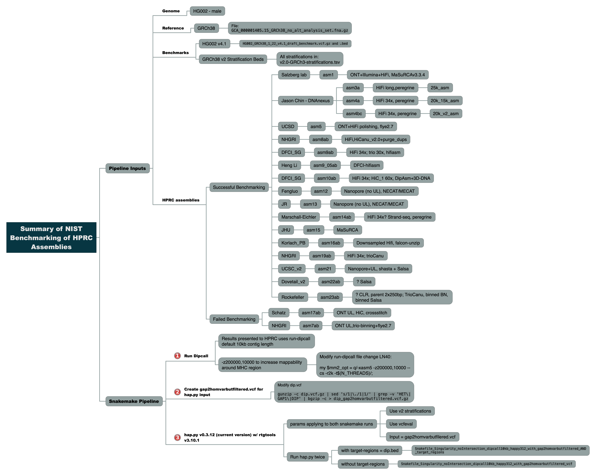

-------------------
GENERAL INFORMATION
-------------------

Title of Dataset: HPRC Assembly Benchmarking with HG002 Assemblies

Principal Investigator: Justin Zook, NIST, jzook@nist.gov

Dataset Contact(s): Nate Olson, nolson@nist.gov and Jennifer McDaniel, jmcdani@nist.gov

--------------------------
SUMMARY
--------------------------

The GIAB Assembly Benchmarking Pipeline provides a pipeline for benchmarking HPRC HG002 
genome assemblies using Dipcall for variant calling against GRCh38 and hap.py for 
benchmarking against GIAB GRCh38 v4.1 benchmark using v2.0 stratifications.

--------------------
DATA & FILE OVERVIEW
--------------------
### Files required for running Snakemake pipelines
- Snakefiles for Snakemake pipeline runs:

  - with target-regions : `Snakefile_Singularity_noIntersection_dipcall10kb_happy312_with_gap2homvarbutfiltered_AND_target_regions`

  - without target-regions : `Snakefile_Singularity_noIntersection_dipcall10kb_happy312_with_gap2homvarbutfiltered_vcf`

- configuration file for snakemake pipelines : `config.yaml`

- Directory `envs/` contains conda environment yamls for tools

- sample file for snakemake pipelines containing paths to assemblies : `samples_all.tsv`

- Directory `src/` contains source code for Dipcall- Directory `assemblies/` contains information on the assemblies that were evaluated along with md5 checksums for assembly files that were benchmarked.

- Directory `assemblies/` contains information on the assemblies that were evaluated along with md5 checksums for assembly files that were benchmarked.

### Benchmarking Results
- Directory `summary_metrics_from_R/` contains the following:

- Benchmarking summary results (`*V4.1_results.extended.csv`) from hap.py are located in `summary_metrics_from_R/ext_results_for_R/`

- `dipcall_10kbAND50kb_happy312_with_gap2homvarbutfiltered_target_regions.csv` contains the benchmarking summary      metrics for all assemblies.  Note only results with field "dipcall_contig" = 10 used for HPRC assembly evaluation. "dipcall_contig" = 50 was used in evaluating parameters for snakemake pipeline.  The summary csv file was generated in R using Rscript `HPRC-Assembly_Benchmarking_with_TargetRegions-Compare_two_benchmark_runs.R`

--------------------------
METHODOLOGICAL INFORMATION
--------------------------

### GIAB-based Benchmarking Methods for HPRC Evaluation Paper

Using GIAB Benchmark Variants with GA4GH Stratifications to Evaluate Performance
Small variant-based assembly benchmarking provides an orthogonal assembly evaluation method characterizing the base level accuracy of the assembly. Benchmarking tools from GIAB and GA4GH enable performance to be stratified by type of error (e.g., genotyping errors) and genome context (e.g., segmental duplications). Variants were first called using the dipcall assembly variant calling pipeline (https://github.com/lh3/dipcall, PMID:30013044). Briefly, dipcall first aligns an assembly to the GRCh38 reference genome (ftp://ftp.ncbi.nlm.nih.gov/genomes/all/GCA/000/001/405/GCA_000001405.15_GRCh38/seqs_for_alignment_pipelines.ucsc_ids/GCA_000001405.15_GRCh38_no_alt_analysis_set.fna.gz) using minimap2 (https://github.com/lh3/minimap2, doi:10.1093/bioinformatics/bty191). We used optimized alignment parameters -z200000,10000 to improve alignment contiguity, as previously shown to improve variant recall in regions with dense variation like the Major Histocompatibility Complex (https://doi.org/10.1101/831792). Dipcall uses the resulting alignment to generate a bed file with haplotype coverage and call variants. All filtered variants except those with the GAP2 filter were removed. GAP2 filtered variants occurred particularly in primary-alternate assemblies in homozygous regions where the alternate contig was missing.  These GAP2 variants were kept as filtered to give separate performance metrics for them, and we treated them as homozygous variant by changing the genotype (GT) field from 1|. to 1|1. The resulting variant calls were benchmarked using hap.py v0.3.12 with the RTG Tools (v3.10.1) vcfeval comparison engine (https://github.com/Illumina/hap.py, https://doi.org/10.1038/s41587-019-0054-x). Note that earlier versions of hap.py and vcfeval will not output lenient regional variant matches to the FP.al field.  The hap.py comparison was performed with the V4.1 Genome In A Bottle HG002 small variant benchmark vcf and bed (ftp://ftp-trace.ncbi.nlm.nih.gov/ReferenceSamples/giab/release/AshkenazimTrio/HG002_NA24385_son/NISTv4.1/GRCh38/, https://doi.org/10.1101/2020.07.24.212712 ) and V2.0 of the GIAB genome stratifications (doi:10.18434/M32190). To improve reproducibility and transparency Snakemake (https://snakemake.readthedocs.io/en/stable/, https://doi.org/10.1093/bioinformatics/bts480) was used for pipeline construction and execution (github url?).  The extensive performance metrics output by hap.py in the extended.csv files were summarized in the following metrics for Completeness, Correctness, and Hard Regions.

Completeness metrics were calculated from SNV FN rate or Recall to assess how much of the benchmark does the callset cover (e.g., where 100% means capturing all variants, and 0% means capturing none of the variants). These completeness metrics can be calculated at different stringencies, with SNP.Recall_ignoreGT having the most lenient matching to be counted as a true positive, and SNP.Recall.fullydiploid having the most stringent matching. `SNP.Recall_ignoreGT` is a measure of how well the assembly captures at least one of the variant alleles. Variant counted as TP if at least one allele in a variant is called correctly, regardless of whether genotype is correct. This is calculated from `(SNP.TRUTH.TP + SNP.FP.gt) / SNP.TRUTH.TOTAL` for the row with “ALL” in the FILTER column. `SNP.Recall` is a measure of how well the assembly represents genotypes. A variant only counted as TP if variant and genotype are called correctly. When only one contig is present assumes the region is homozygous. This is calculated from METRIC.Recall for TYPE=SNP, SUBTYPE=*, SUBSET=*, FILTER=ALL.  `SNP.Recall.fullydiploid`is a measure of how well the assembly represents both haplotypes correctly, requiring that exactly one contig from each haplotype aligns to the location (contigs smaller than 10kb are ignored by dipcall by default). This is calculated from METRIC.Recall for TYPE=SNP, SUBTYPE=*, SUBSET=*, FILTER=PASS.

Correctness metrics were calculated from the false positive rate for SNVs and INDELs, converted into a phred scaled per base error rate. Each SNP and INDEL counted as a single error on one haplotype regardless of size and genotype. `QV_dip_snp_indel` is the error rate in all benchmark regions, calculated as `-10*log10((SNP.QUERY.FP + INDEL.QUERY.FP)/(Subset.IS_CONF.Size*2))`. `NoSegDup.QV_dip_snp_indel` is the same as QV_dip_snp_indel except that it excludes segmental duplication regions.

Hard Regions metrics were calculated for particularly difficult-to-assemble regions like segmental duplications and the MHC. `Segdup.QV_dip_snp_indel` is the same as the `QV_dip_snp_indel` Correctness metric, but only for segmental duplication regions. `MHC.QV_dip_snp_indel` is the same as the `QV_dip_snp_indel` Correctness metric, but only for the MHC. `MHC.SNP.Recall` is the same as the `SNP.Recall` Completeness metric, but only for MHC.

## Snakemake Pipeline Information

To generate benchmarking results two snakemake pipelines were run 1) with hap.py using target-regions = .dip.bed from Dipcall output and 2) without hap.py target-regions. The pipelines assume genome HG002, GRCh38 reference and associated GIAB v4.1 benchmarks and v2.0 stratifications. The pipelines automate running of assemblies through variant calling with Dipcall and benchmarking using hap.py v.0.3.12

### Pipeline Dependencies
- Snakemake >v5.5.2
- Docker
- hap.py v0.3.12 in Docker container 
  - docker://jmcdani20/hap.py:v0.3.12
  - Docker container built from hap.py v0.3.12 source code:
    https://github.com/Illumina/hap.py/releases
  - hap.py input uses modified dip.vcf --> dip.gap2homvarbutfiltered.vcf.gz
  - hap.py was run twice, with (dip.bed) and without target-regions. Snakefile names 
    denotes if hap.py is run with our without target-regions.
  - utilizes vcfeval for comparing complex variants
- Dipcall found in `src/` directory
  - Dipcall source code reterieved from https://github.com/lh3/dipcall
  - uses docker container for k8 binaries
  - Dipcall file LN 40 modified (my $mm2_opt = q/-xasm5 -z200000,10000 --cs -r2k -t$(N_THREADS)/;) 
    for better mapping to MHC, all other parameters are original default parameters for Dipcall.
    More information on Dipcall modification can be found here:

    https://github.com/NCBI-Hackathons/TheHumanPangenome/tree/master/MHC/benchmark_variant_callset/MHCv1.0/assembly
- GIAB GRCh38 Benchmark v4.1 files from:

	ftp://ftp-trace.ncbi.nlm.nih.gov/ReferenceSamples/giab/release/AshkenazimTrio/HG002_NA24385_son/latest/GRCh38/HG002_GRCh38_1_22_v4.1_draft_benchmark.vcf.gz

  ftp://ftp-trace.ncbi.nlm.nih.gov/ReferenceSamples/giab/release/AshkenazimTrio/HG002_NA24385_son/latest/GRCh38/HG002_GRCh38_1_22_v4.1_draft_benchmark.vcf.gz.tbi

  ftp://ftp-trace.ncbi.nlm.nih.gov/ReferenceSamples/giab/release/AshkenazimTrio/HG002_NA24385_son/latest/GRCh38/HG002_GRCh38_1_22_v4.1_draft_benchmark.bed.gz

  ftp://ftp-trace.ncbi.nlm.nih.gov/ReferenceSamples/giab/release/AshkenazimTrio/HG002_NA24385_son/latest/GRCh38/HG002_GRCh38_1_22_v4.1_draft_benchmark.bed.gz.tbi

- GIAB GRCh38 v2.0 stratifications

ftp://ftp-trace.ncbi.nlm.nih.gov/ReferenceSamples/giab/release/genome-stratifications/v2.0/GRCh38/
