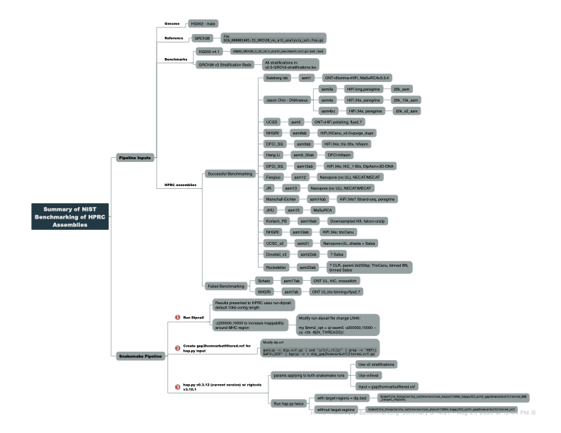

-------------------
GENERAL INFORMATION
-------------------

Title of Dataset: HPRC Assembly Benchmarking with HG002 Assemblies

Author Information (Name, Institution, Address, Email)

	Principal Investigator: Justin Zook, NIST, jzook@nist.gov
	Dataset Contact(s): Jennifer McDaniel, jmcdani@nist.gov

--------------------------
SUMMARY
--------------------------

The GIAB Assembly Benchmarking Pipeline provides a pipeline for benchmarking HPRC HG002 
genome assemblies using Dipcall for variant calling against GRCh38 and hap.py for 
benchmarking against GIAB GRCh38 v4.1 benchmark using v2.0 stratifications.

--------------------------
SHARING/ACCESS INFORMATION
--------------------------

--------------------
DATA & FILE OVERVIEW
--------------------
`assemblies\`
Directory contains information on the assemblies assemblies that were benchmarked along with md5 checksums for assembly files that were benchmarked.

`src\`
Binaries for Dipcall

`summary_metrics_from_R\`

Benchmarking summary results (*V4.1_results.extended.csv) from hap.py are located in `summary_metrics_from_R/ext_results_for_R/`

`dipcall_10kbAND50kb_happy312_with_gap2homvarbutfiltered_target_regions.csv` contains the benchmarking summary metrics for all assemblies.  Note only results with field dipcall_contig = 10 used for HPRC assembly evaluation. Dipcall_contig = 50 was used in evaluating parameters for snakemake pipeline.  The summary csv file was generated in R using Rscript `HPRC-Assembly_Benchmarking_with_TargetRegions-Compare_two_benchmark_runs.R`

--------------------------
METHODOLOGICAL INFORMATION
--------------------------

## Dependencies
    - Snakemake >v5.5.2
    - Docker
    - docker container "docker://jmcdani20/hap.py:v0.3.12"
      Docker container built from hap.py v0.3.12 source code:
      https://github.com/Illumina/hap.py/releases
    - Dipcall found in src directory
    - GIAB GRCh38 Benchmark v4.1 files from:
	  ftp://ftp-trace.ncbi.nlm.nih.gov/ReferenceSamples/giab/release/AshkenazimTrio/HG002_NA24385_son/latest/GRCh38/HG002_GRCh38_1_22_v4.1_draft_benchmark.vcf.gz
    ftp://ftp-trace.ncbi.nlm.nih.gov/ReferenceSamples/giab/release/AshkenazimTrio/HG002_NA24385_son/latest/GRCh38/HG002_GRCh38_1_22_v4.1_draft_benchmark.vcf.gz.tbi
    ftp://ftp-trace.ncbi.nlm.nih.gov/ReferenceSamples/giab/release/AshkenazimTrio/HG002_NA24385_son/latest/GRCh38/HG002_GRCh38_1_22_v4.1_draft_benchmark.bed.gz
    ftp://ftp-trace.ncbi.nlm.nih.gov/ReferenceSamples/giab/release/AshkenazimTrio/HG002_NA24385_son/latest/GRCh38/HG002_GRCh38_1_22_v4.1_draft_benchmark.bed.gz.tbi

2) Two pipelines were run 
Pipeline retrieves the following 
    - GRCh38 reference fasta (see config.yaml for ftp)

3) Dipcall in "src" directory. Dipcall source code reterieved from https://github.com/lh3/dipcall
    - uses docker container for k8 binaries
    - Dipcall file LN 40 modified (my $mm2_opt = q/-xasm5 -z200000,10000 --cs -r2k -t$(N_THREADS)/;) 
      for better mapping to MHC, all other parameters are original default parameters for Dipcall.
      More information on Dipcall modification can be found here:
      https://github.com/NCBI-Hackathons/TheHumanPangenome/tree/master/MHC/benchmark_variant_callset/MHCv1.0/assembly
      
4) hap.py (https://github.com/Illumina/hap.py)
    - hap.py input uses modified dip.vcf --> dip.gap2homvarbutfiltered.vcf.gz
    - hap.py was run twice, with (dip.bed) and without target-regions. Snakefile names 
      denotes if hap.py is run with our without target-regions.
    - utilizes vcfeval for comparing complex variants